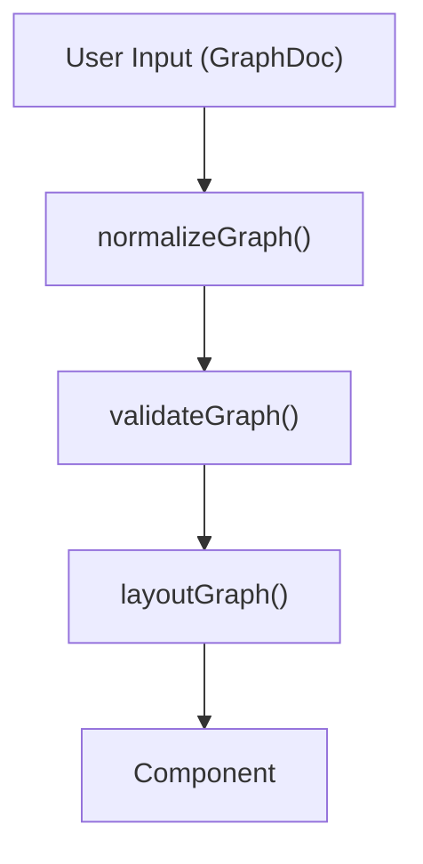

# Documentation Specification

## Overview

**Purpose**: Define standards and templates for all repository documentation (JSDoc comments, READMEs, specs, type documentation).

**Scope**: All documentation authored in this repository, including TypeScript/React components, package exports, and README content.

**Version**: 0.0.0

## JSDoc Comment Standards

### Function/Method Comments

**Style**: TSDoc/JSDoc with TypeScript types

**Includes**:
- Purpose description
- Parameter descriptions with types
- Return value explanation
- Example usage (for public APIs)

### Function Comment Template

**Required**: true for all exported functions

**Format**:
```typescript
/**
 * One-line purpose sentence.
 *
 * Extended description if needed for complex functions.
 *
 * @param paramName - Description of the parameter
 * @param optionalParam - Description (optional parameters noted)
 * @returns Description of the return value
 * @throws {ErrorType} When this error occurs
 *
 * @example
 * ```typescript
 * const result = functionName(arg1, arg2);
 * ```
 */
```

**Notes**:
- Use `@param` for parameters, not `@arg`
- Include `@returns` (not `@return`)
- Type annotations come from TypeScript, not JSDoc
- Keep lines ≤ 100 characters

## Component Documentation

### React Component Template

**Required**: true for all exported components

**Format**:
```typescript
/**
 * Brief description of what the component does.
 *
 * @remarks
 * Extended description of component behavior, state management,
 * and integration details.
 *
 * @example
 * ```tsx
 * <ComponentName prop1="value" prop2={data} />
 * ```
 */
```

### Props Interface Documentation

**Required**: true for all props interfaces

**Format**:
```typescript
export interface ComponentProps {
  /** Description of this prop */
  propName: string;
  /** Description of optional prop */
  optionalProp?: number;
  /** Callback description with signature */
  onEvent?: (data: EventData) => void;
}
```

## Module/File Documentation

### Module Header Template

**Required**: true for all package entry points and major modules

**Format**:
```typescript
/**
 * Module title
 *
 * Brief description of what this module provides.
 *
 * @packageDocumentation
 * @module @flowcn/package-name
 */
```

### Type Export Documentation

**Required**: true for all exported types/interfaces

**Format**:
```typescript
/**
 * Brief description of the type.
 *
 * @remarks
 * Extended description of when and how to use this type.
 */
export interface TypeName {
  /** Property description */
  property: Type;
}
```

## README Standards

### Package README Template

**Mandatory Sections**:

#### Header
- Package name with npm badge
- One-line description

#### Overview
- Concise paragraph explaining the package's purpose
- What problems it solves
- Primary exports

#### Installation
```markdown
## Installation

```bash
npm install @flowcn/package-name
# or
pnpm add @flowcn/package-name
```
```

#### Quick Start
- Minimal working example
- Import statements
- Basic usage

#### API Reference
- Key exports with brief descriptions
- Links to detailed documentation

#### Dependencies
- Peer dependencies
- Required runtime dependencies

### Demo App README

**Mandatory Sections**:
- Overview with screenshot
- Getting Started (Docker commands)
- Examples list with descriptions
- Development commands

## Inline Comments

**Purpose**: Clarify non-obvious or critical logic

**Guidelines**:
- Explain the "why" not the "what"
- Focus on algorithmic decisions and edge cases
- Keep comments up-to-date with code changes
- Use `// TODO:` for future work items
- Use `// FIXME:` for known issues

**Anti-patterns**:
```typescript
// Bad: Describes what the code does
i++; // Increment i

// Good: Explains why
i++; // Skip the header row in layout calculation
```

## Diagram Standards

### Mermaid Diagrams

**Type**: Use `graph TD` for data flow, `graph LR` for pipelines

**Style**:
- Use clear, descriptive node names
- Use quotes for all node text
- Use `<br/>` for line breaks in labels

**Requirement**: A Mermaid diagram is mandatory for any spec describing multi-component interactions.

**Example**:
```markdown

```

## Documentation Quality Standards

### Clarity Requirements
- Use clear, concise language
- Avoid unnecessary jargon
- Provide context for complex concepts
- Include examples for abstract ideas

### Completeness Standards
- Cover all public APIs and exports
- Document all configuration options
- Include error handling information
- Provide troubleshooting guidance

### Maintenance Guidelines
- Keep documentation synchronized with code
- Review and update with each release
- Version documentation with code releases

## References

- [Specification Formatting Standards](./formatting_spec.md)
- [Repository Specification](../10-architecture/repo_spec.md)
- [TypeScript JSDoc Reference](https://www.typescriptlang.org/docs/handbook/jsdoc-supported-types.html)
