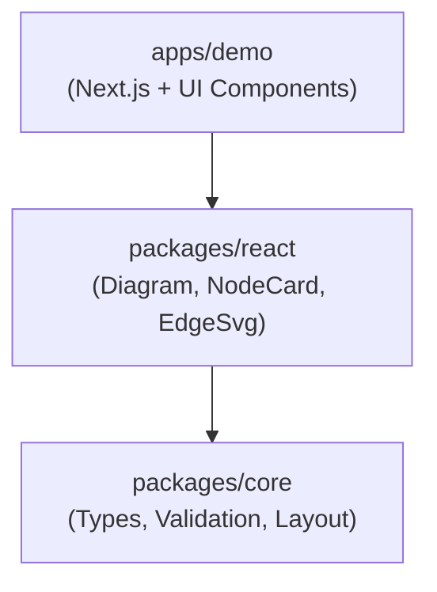
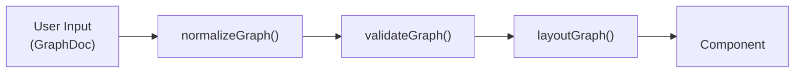

# Architecture Specification

## Overview

**Purpose**: Define flowcn's monorepo architecture, package boundaries, Docker-first approach, and versioning rules.

**Scope**: Repository layout, package structure, environment strategy, and releases.

**Version**: 0.0.0

## Core Design Principles

### 1. Determinism

**Guarantee**: The same input graph always produces the same layout output.

**Implementation**:
- All nodes and edges are sorted by ID before processing
- Layout algorithms use stable sorting with ID tiebreakers
- Edge IDs are auto-generated deterministically from source, target, and index
- No randomness or timestamps in any computation

**Benefits**:
- Predictable rendering across sessions
- Reliable testing and debugging
- Version control friendly (diffs show actual changes)

### 2. Real UI Components

**Nodes as Cards**: Unlike traditional diagram libraries that render everything as SVG, flowcn renders nodes as actual DOM elements using shadcn/ui Card components.

**Benefits**:
- Native browser interactions (focus, hover, accessibility)
- CSS-based styling with Tailwind
- Better text rendering and selection
- Easier integration with UI component libraries

**Trade-offs**:
- More complex positioning (absolute positioning required)
- SVG overlay needed for edges
- Slightly higher DOM node count

### 3. Docker-First Development

**No Host Dependencies**: Developers do not need to install Node, npm, pnpm, or any build tools on their host machine.

**Implementation**:
- Multi-stage Dockerfile for dev and prod
- Named volumes for node_modules persistence
- File watching with polling for cross-platform compatibility
- Single command startup: `docker compose up`

## Monorepo Layout

```
flowcn/
├── packages/
│   ├── core/              # @flowcn/core - Graph types, validation, layout
│   └── react/             # @flowcn/react - React renderer components
├── apps/
│   └── demo/              # Next.js demo application
├── docs/                  # Design documentation (legacy)
├── documentation/         # Specification documents
├── docker-compose.yml     # Development environment
├── Dockerfile             # Multi-stage Docker build
├── Makefile              # Development commands
└── pnpm-workspace.yaml   # Workspace configuration
```

### Package Structure

**Requirements**:
- Enforce clear ownership per directory
- Packages must be importable and tested independently
- Apps depend on published APIs from packages only (no deep imports)
- No circular dependencies between packages

### Directory Responsibilities

| Directory | Purpose | Exports |
|-----------|---------|---------|
| `packages/core` | Pure TypeScript types, validation, layout algorithms | Types, `normalizeGraph`, `validateGraph`, `layoutGraph` |
| `packages/react` | React components for rendering | `Diagram`, `NodeCard`, `EdgeSvg`, hooks |
| `apps/demo` | Next.js demo showcasing examples | N/A (application) |
| `documentation` | Specifications and guides | N/A (documentation) |

## Three-Layer Architecture



**packages/core**: Pure TypeScript with no UI dependencies. Handles graph data structures, validation, and layout computation.

**packages/react**: React components that consume core types and render interactive diagrams.

**apps/demo**: Next.js application showcasing examples with controls and inspector panels.

## Data Flow



1. **Input**: User provides a `GraphDoc` object with nodes, edges, and layout options
2. **Normalization**: `normalizeGraph()` assigns stable IDs and sorts collections
3. **Validation**: `validateGraph()` checks for errors and returns diagnostics
4. **Layout**: `layoutGraph()` computes positions and edge routes
5. **Rendering**: `<Diagram>` component renders nodes as cards and edges as SVG

## Package Dependencies

### Dependency Rules

1. `packages/core` has NO dependencies on other flowcn packages
2. `packages/react` depends on `packages/core`
3. `apps/demo` depends on both `packages/core` and `packages/react`
4. No circular dependencies allowed

### External Dependencies

**packages/core**:
- Zero runtime dependencies (pure TypeScript)

**packages/react**:
- React (peer dependency)
- `@flowcn/core` (workspace dependency)

**apps/demo**:
- Next.js
- React
- shadcn/ui components
- Tailwind CSS

## Versioning & Releases

### Semantic Versioning (SemVer)

- **MAJOR**: Breaking changes to public API
- **MINOR**: New features, backward compatible
- **PATCH**: Bug fixes, internal changes

### Package Versioning

All packages share the same version number for simplicity:
- `@flowcn/core`: 0.0.0
- `@flowcn/react`: 0.0.0

Version bumps must be reflected in each package's `package.json` prior to release.

### Release Process

1. Update version in all `package.json` files
2. Update `release_notes.md`
3. Build all packages: `pnpm build`
4. Run tests: `pnpm test`
5. Commit and tag release

## Build System

### Package Building

**Tool**: tsup (TypeScript bundler)

**Output Formats**:
- ESM (`.mjs`, `.d.mts`)
- CJS (`.js`, `.d.ts`)

**Build Command**: `pnpm build` (workspace root)

### Development Workflow

**Start Dev Server**:
```bash
docker compose up dev
# or
make dev
```

**Run Tests**:
```bash
docker compose run --rm dev pnpm test
```

**Build Packages**:
```bash
docker compose run --rm dev pnpm build
```

## Testing Strategy

### Unit Tests

**Location**: `packages/core/src/**/*.test.ts`

**Focus**:
- Determinism: Same input produces identical output
- Validation: All error cases caught
- Edge cases: Empty graphs, single nodes, cycles

**Framework**: Vitest with Node environment

### Component Tests

**Location**: (future) `packages/react/src/**/*.test.tsx`

**Focus**:
- Rendering correctness
- Interaction handling
- Accessibility

## References

- [Repository Specification](./repo_spec.md)
- [Docker Operations Specification](../20-operations/docker_ops_spec.md)
- [Monorepo Operations Specification](../20-operations/monorepo_ops_spec.md)
- [Core Package Specification](../30-packages/core_spec.md)
- [React Package Specification](../30-packages/react_spec.md)
