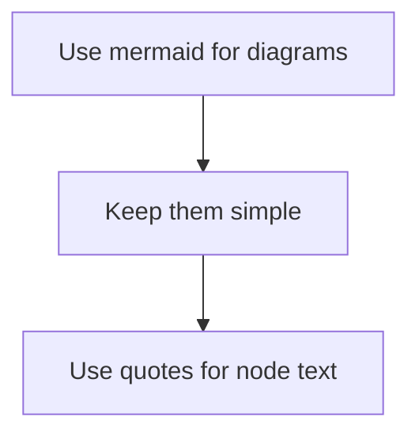

# [SPECIFICATION_TITLE]

## Overview

**Purpose**: [One-line description of what this spec covers]

**Scope**: [What systems/components this applies to]

**Version**: [X.Y.Z]

## [MAJOR_SECTION_1]

### [Subsection 1.1]

**Summary**: [Brief description of the rule/protocol]

**Process**: [Step-by-step description of how this works]

**Requirements**:
- [Requirement 1]
- [Requirement 2]

**Example**:
```typescript
// Code example showing the pattern
export function exampleFunction(
  param1: string,
  param2: number,
): boolean {
  /** Example JSDoc following standards. */
  return true;
}
```

**Notes**:
- [Important note 1]
- [Important note 2]

## [MAJOR_SECTION_2]

### [Subsection 2.1]

**Pattern**: [Description of the pattern or rule]

**Implementation**:
1. [Step 1]
2. [Step 2]
3. [Step 3]

### [Subsection 2.2]

| Column 1 | Column 2 | Column 3 |
|----------|----------|----------|
| Value A  | Value B  | Value C  |

## Validation Checklist

**Pre-Completion Checklist**:
- [ ] [Check item 1]
- [ ] [Check item 2]
- [ ] [Check item 3]

## References

- [Related spec 1](./path-to-spec.md)
- [Related spec 2](./path-to-spec.md)
- [External documentation](https://example.com)

---

## Template Usage Instructions

### When to Use This Template

Use this template when creating new specifications for:
- New packages or modules
- New features or capabilities
- New protocols or procedures
- New coding standards or rules

### Required Sections

Every specification MUST include:
1. **Overview** - Purpose, Scope, Version
2. **At least one Major Section** - Core content
3. **Validation Checklist** - Verification criteria
4. **References** - Related documents

### Optional Sections

Include as needed:
- Examples and code samples
- Diagrams (Mermaid)
- Tables for structured data
- Migration notes
- Deprecation notices

### Naming Convention

**File Name**: `<topic>_spec.md`
- Use snake_case
- Suffix with `_spec`
- Examples: `core_spec.md`, `docker_ops_spec.md`

### Placement

Place new specs in the appropriate directory:
- `00-governance/` - Standards, protocols, agent behavior
- `10-architecture/` - System design, code standards
- `20-operations/` - Development operations, releases
- `30-packages/` - Package-specific specifications
- `90-templates/` - Templates and patterns

### Version Numbers

**Format**: MAJOR.MINOR.PATCH (following SemVer)

**When to Increment**:
- MAJOR: Breaking changes to spec requirements
- MINOR: New sections or requirements
- PATCH: Clarifications, typo fixes

### Cross-References

When referencing other specs:
- Use relative paths: `[Spec Name](./path.md)`
- Verify links are valid
- Update when specs are moved

### Code Examples

**TypeScript**:
```typescript
// Use typescript for TypeScript code
```

**TSX (React)**:
```tsx
// Use tsx for React components
```

**Shell Commands**:
```bash
# Use bash for shell commands
```

**JSON**:
```json
{
  "use": "json for configuration"
}
```

### Mermaid Diagrams



### Quality Checklist for New Specs

Before submitting a new specification:
- [ ] Overview section complete with Purpose, Scope, Version
- [ ] All sections have content (no empty placeholders)
- [ ] Code examples compile/work
- [ ] References are valid links
- [ ] Follows formatting standards
- [ ] Version number set appropriately
- [ ] Added to nav_spec.md index
